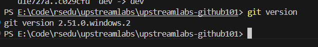

# Git工具安装与使用报告

## 学员GitHub用户名: PaiGack

## 1. Git安装过程

（在此处详细描述Git的安装过程，包括使用的操作系统、安装方法等）

## 2. 遇到的问题及解决方法

### 2.1 下载 git 安装包速度慢
解决办法: 
1. 使用科学上网
2. 使用国内的镜像源下载, 例如 https://mirrors.tuna.tsinghua.edu.cn/github-release/git-for-windows/git/

## 3. 版本信息截图



## 4. Git命令使用过程总结

（在此处总结使用Git命令的过程，包括但不限于以下操作：等其他相关命令的使用体验和理解）

- git clone: 克隆远程仓库到本地

克隆过程需要访问源地址,如果源地址是 github 或者其他国外的 git 服务器,那么需要使用科学上网

例如克隆仓库到本地
```bash
# https 访问
git clone https://github.com/PaiGack/upstreamlabs-github101.git
# 或者 ssh 访问
git clone git@github.com:PaiGack/upstreamlabs-github101.git

# 指定本地目录
git clone https://github.com/PaiGack/upstreamlabs-github101.git ./my-project

# 只克隆指定分支
git clone -b main https://github.com/PaiGack/upstreamlabs-github101.git

# 只克隆最后一次提交
git clone --depth 1 https://github.com/PaiGack/upstreamlabs-github101.git
```

- git add: 添加文件到暂存区
```bash
# 添加全部文件
git add .

# 添加指定文件
git add README.md

# 添加指定目录下的所有文件
git add assignments/
```

- git commit: 提交更改到本地仓库

```bash
# 简略提交
git commit -m "add README.md"

# 完整提交
git commit
```

- git push: 推送更改到远程仓库

```bash
# 直接推送
git push

# 强制推送
git push -f

# 指定推送源
git push origin main
```

- git pull: 从远程仓库拉取最新更改
```bash
# 直接拉取
git pull

# 指定拉取源
git pull origin main
```

- git status: 查看当前仓库状态
```bash
git status
```
- git stash: 临时保存更改
```bash
# 临时保存
git stash

# 临时恢复
git stash pop

# 临时保存列表
git stash list

# 临时保存删除
git stash drop

# 临时全部清理
git stash clear
```

- git remote: 查看远程仓库
```bash
# 查看远程仓库
git remote -v

# 添加远程仓库
git remote add origin https://github.com/PaiGack/upstreamlabs-github101.git

# 删除远程仓库
git remote rm origin
```

- git log: 查看提交历史
```bash
git log
```

- git: 分支管理
```bash
# 创建分支
git branch -b feature

# 切换分支
git checkout feature

# 删除分支
git branch -d feature

# 合并分支
git merge feature
```

- git config: 配置Git

```bash
# 配置账号信息
git config --global user.name "PaiGack"
git config --global user.email "PaiGack@example.com"

# 配置代理
git config --global http.proxy http://127.0.0.1:8888
git config --global https.proxy http://127.0.0.1:8888
```

## 其他:

1. 推荐使用 GitHub Desktop 进行可视化管理,而且这个不需要科学上网
2. 在 vscode 或者 idea 中使用 git 插件进行可视化管理
